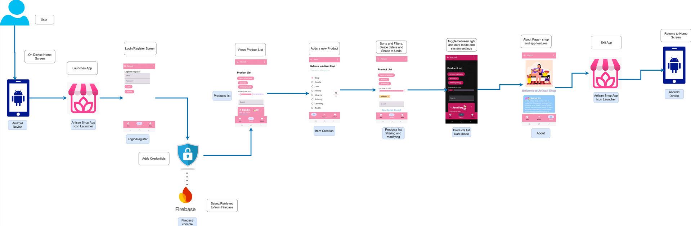

# Artisan App - Technical Report - README.md - MAD Assignment two - Full Release Branch.


# Personal Statement
I hereby certify that this assignment is all my own work, unless explicitly referenced or attributed to other sources.
I have read the sections on referencing and plagiarism in the handbook or in the SETU Quality Manual and I understand that only assignments which are free of plagiarism will be awarded marks. I further understand that SETU has a plagiarism policy which can lead to the suspension or permanent expulsion of students in serious cases (SETU, 2023).
Signed : Emily Halley(20092335)

Date: 10/05/2025
Artisan App

# Student Information
- Name: Emily Halley
- Student number: 20092335
- YouTube Video: https://youtu.be/hJmK55YyQoA


# Installation
Clone the repository and add your own FB Auth Key and install google-services
```bash
   git clone https://github.com/emily172/MAD2-Artisan.git
```

# Artisan Shop App


The Artisan App is designed for homemakers to add and manage various categories of items,
such as soaps, candles, and jams, through an easy-to-use interface.
These features are displayed across various screens, including the Details Screen, Record Screen, Items Card, List, and Item Screen, enhancing the overall functionality and user experience.

The app contains new fields such as price, category, rating, and availability to add value to each product. It includes a search feature to help users filter and find specific items.
Users can view detailed information about each product and edit descriptions as needed.

All of the features have additional UI such as on the record page icons for product creation have new buttons for filtering, emojis, price and category displayed on the card in two new colours without expanding the detail also, when the item expands a divider and icons associated for each product. The same applies similarly to the About page.

New features of the application include a sorting and filtering feature for each product on the record screen; were the user can filter based on categories i.e.  Soap, Candle, Vegan etc. each one can be selected multiple times for filtering and update the chip with the categories and contains a colour chip displayed under the price slider. Another one sorting and filtering feature to filter items based on the newest, oldest, rating, price low to high/high to low and a price slider to filter product by price range. For the About page there is a new search bar to search for FAQs. Users can locate the login and register page to create an account all handed using firebase authentication.

The app also features a delete swipe action function by swiping left on the card and an undo function by simply shaking the device.  Additionally, the app adapts accordingly to colour scheme to maintain a visually appealing interface either in dark or light mode as well as a new toggle button between light or dark changing the colour on the record screen adapting to theme, colour, app and device adjustments editing items, ensuring efficient management of products and explanation for each one. Additional functionalities and features are included in the about section with a pulsing welcome message, expandable cards contain FAQs, journey, search bar, key features and plain card with about us and contact information. The launcher app is updated with an artisan shop logo upon launcher and when items have exceeded their amount.

# UML & Class Diagrams
Workflow diagram for Artisan Application




# Main Features
## State Features
- **Item Type**: Updates with a different items are selected from the radio group button options.
- **Item Amount**: Adjusts the amount of items permitted by amount.
- **Item Picker**: Selects the amount of inventory amount in 10s once reached 100 limit exceeded.
- **Item Description**: Write a message about the product for example strawberry candle.
- **Item Inventory**: View the total number of items in the inventory and track the progress.
- **Calculate Total Items**: total items + inventory = sumOf function on each item added.
- **Search and Filter**: Search through the inventory and filter items by type.
- **Updating Inventory List**: Controlled using the SnapshotStateList to store all the items added by the user which triggers a recomposition of the UI to reflect the changes.
- **Handling User Interactions**: Add button triggered item inventory bar increases each new item added to list.
- **Toast Notification**: Receive a toast notification when the total items exceed 100 to say limit exceeded.

## Navigation Features
- **NavHostProvider**: Sets up the navigation host for the app, defining the start destination and routes to different screens.
- **TopAppBarProvider**: Provides the top app bar with navigation and action buttons, including a back button and a drop-down menu.
- **BottomAppBarProvider**: Provides the bottom app bar with navigation buttons to switch between different sections of the app.
- **Room Database**: Used for local storage to store all of the artisan products.
- **Model**: Represents the data layer (Room entities, DAO interfaces).
- **View**: Represents the UI layer (Activities, Fragments).
- **ViewModels**: Refactoring the project to address managing UI-related data in the application.
- **Hilt**: Dependency injection.

## Delete & Update Features
- **Delete**: Remove an item with confirmation screen.
  -**Message Field**: Updating a message or description in the card list.
  -**Alert Warning**: A field needs to be filled in for the card to be saved.


## Customization  Features
- **Price**: Added a price for a product.
- **Category**: Give the product a category.
- **Rating**: Add a rating to the product.
- **Record List**: Displays a list of products.
- **Detail Screen**: Displays each item details such as item type, item amount, date added, price, category, rating, and availability.
  The fields `price`, `category`, `rating`, and `availability` are read-only, while the description field is editable.
- **Search and Filter**: Search through the products and filter items by type.
  Users can search for products using the search field. Selecting a product navigates to the `DetailsScreen`. when the user clicks Show More... .


## Colours and Themes Features
- **Colours**: Updating the primary,secondary and tertiary scheme for applying to light and dark mode.
- **Themes**: Setting those changes with the application.

# New Features

## Icons and Improved Colours Features
Improved card size, colours, fields, text and icons for each product card.
- **Card**: Increased size of the card for more information.
- **Text**: Two text fields price and category are called and seen as main information without showing details.
- **Icons**: Icons are assigned based on category for example if a user for soap types bubbly the bubble icon appears
If the category is not included in the list of categories it's default icon is a cottage house.

## Sorting and Filtering Features
Improved sorting and filtering chips containing category and products for each product card.
- **Product**: Sorts and filters the cards by Price Low to High, Price High to Low, Rating, Newest and Oldest.
- **Category**: Sorts and filters the cards by Soap, Candle, Jam, Pottery, Weaving, Painting, Jewellery, N/A, Textile and "All".
- **Chips**: Product and Category are sorted using chips that contain a drop-down menu to select from.
- **Category Chips**: When a category is selected it's displayed as a coloured chip with in relation the category's theme.

## Sorting and Filtering Features with Price Slider
Improved sorting and filtering  with a price slider.
- **Price Slider**: Adds a price range to filter with a slider to filter a cost point.
- **Sorting and & Filtering**: Reduced the size of the sorting and filtering options to suit the screen better.

## Swipe Action and Undo Delete Device Shake Features
Swiping actions to delete and shake option to undo delete action.
- **Swipe-to-Delete**: Delete a product by swiping left to remove from the list.
- **Shake-to-Undo-Delete**: Shake the device to prevent accidental delete and retrieve the product back on the item list.

## Dark Mode Toggle Button Feature
Contains a button to switch between light and dark mode.
- **Light & Dark Mode**: Change the content from light to dark mode by tapping the button.

## About Page Features
Improved and updated About Screen giving more information about the Application.
- **Pulsing Welcome**: Welcome text pulses when it gets larger has a cyan blue colour.
- **Emojis**: Shows emojis to represent each section.
- **Colours**: Follows the predetermined theme already stated and adjusts colours based on light and dark mode.
- **Expandable Cards**: Displays information about the app and the artisan shop.
- **About Us**: Information about the artisan shop.
- **Our Journey**: The artisan Shop journey for development with the years for each milestone.
- **FAQs**: Common questions about the artisan shop with each question nested under each title.
- **FAQ Search Bar**: Search for a FAQ that is necessary for your needs.
- **Key Features**: Contains all of the applications features and functionality.
- **Contact & Support**: Contact information about if needed to contact the artisan shop.

## Customisation Features
Improved and updated  UI for the application.
- **Icon**: Added an icon button for the application.
- **Categories**: Included new categories.
- **Colours**: Added new colours to the categories.

# Google API – Firebase Authentication – Features
- **Register**: Register with email and password.
- **Login**: Login with email and password.
- **App Access**: Can view Application and contents.
- **Firebase Console**: View users that have an account and analytics usage.

# UX / DX Approach
To implement the artisan shop application, I used the Android Material design as a way to guide me to create the application for user experience and design.

# Git Approach
For each feature created, each change was pushed up to GitHub using committing and pushing from the master local repo to the master repo on my GitHub account and noted each step for the changes made to the lines of code, new files etc. Every time a feature was completed a new release would be created with a tag with a unique name, targeted to the master branch. Added the same uniform title for each release. Added a title for the new feature for each release containing an image to represent the feature, a small description and the added feature for each release.

# References – Accessed between April and May 2025

### Sorting and Filtering, Icons, Colours, About, Price Slider, Dark Mode Toggle Button, Customisation, Swipe Action and Undo Delete Device Shake Features.
https://tutors.dev/topic/mobile-app-dev-2-2025/topic-07-fb-auth
https://tutors.dev/course/mobile-app-dev-2-2025
https://developer.android.com/develop/ui/compose/components/chip
https://developer.android.com/reference/kotlin/androidx/compose/material3/ComponentElevation
https://stackoverflow.com/questions/77894228/kotlin-coroutines-stateflow-not-emitting-identical-values-consecutively-how-to-f
https://medium.com/@avanisoam/managing-datastore-preferences-in-jetpack-compose-a-comprehensive-guide-ecd29f5a9930
https://kotlinlang.org/docs/numbers.html#floating-point-types
https://kotlinlang.org/api/core/kotlin-stdlib/kotlin.ranges/-closed-floating-point-range/
https://kotlinlang.org/api/core/kotlin-stdlib/kotlin.ranges/-int-range/
https://developer.android.com/reference/kotlin/androidx/annotation/FloatRange
https://gist.github.com/PiotrPrus/5b13ad34d596bb7a390b850345b3fc33
https://composables.com/material3/rangeslider
https://kotlinlang.org/api/core/kotlin-stdlib/kotlin.ranges/-closed-range/
https://stackoverflow.com/questions/66892142/how-to-make-sense-of-the-kotlin-closedfloatingpointrange
https://developer.android.com/develop/ui/compose/components/slider
https://kotlinlang.org/api/core/kotlin-stdlib/kotlin.ranges/
https://kotlinlang.org/api/core/kotlin-stdlib/kotlin.ranges/-int-range/end-inclusive.html
https://stackoverflow.com/questions/44386394/is-there-any-method-in-kotlin-which-allow-me-to-translate-a-value-from-a-range-i
https://kotlinlang.org/api/core/kotlin-stdlib/kotlin.text/to-int.html
https://www.jetbrains.com/help/inspectopedia/EmptyRange.html
https://www.freepik.com/free-vector/transfer-files-concept-landing-page_5569538.htm#fromView=search&page=1&position=4&uuid=dd28ddbe-ee55-4026-8f86-0173e88b0116&query=sorting+and+filering
https://developer.android.com/develop/ui/compose/components/card
https://medium.com/better-programming/jetpack-compose-theming-colors-1cf86754d5b9
https://developer.android.com/develop/ui/compose/modifiers
https://medium.com/@acceldia/jetpack-compose-creating-expandable-cards-with-content-9ea1eae09efe
https://developer.android.com/develop/ui/compose/designsystems/material3
https://stackoverflow.com/questions/73756054/what-difference-does-it-make-when-we-use-get-in-kotlin#:~:text=Using%20get()%20creates%20a,backing%20field%20from%20point%201.
https://kotlinlang.org/docs/properties.html
https://developer.android.com/develop/ui/compose/components/divider
https://developer.android.com/develop/ui/compose/components/divider#vertical
https://developer.android.com/develop/ui/compose/animation/quick-guide
https://stackoverflow.com/questions/73860646/modifier-animatecontentsize-does-not-animate-shrinking-of-content
https://developer.android.com/develop/ui/compose/animation/advanced
https://kotlinlang.org/docs/collection-ordering.html
https://developer.android.com/develop/ui/compose/state
https://stackoverflow.com/questions/77405487/how-to-collect-same-object-in-compose
https://medium.com/@mrsaykatm4/differences-between-collectasstate-and-collectasstatewithlifecycle-in-jetpack-compose-c0a6ff282d03
https://medium.com/@oktaygenc/understanding-collectasstate-in-jetpack-compose-58a09b34d944
https://medium.com/@joseph.1hach/everything-you-need-to-know-about-remember-in-android-jetpack-compose-3fb14356365
https://www.reddit.com/r/javascript/comments/1c2kf3q/askjs_javascript_operators_like_or_and_null/
https://developer.android.com/reference/kotlin/androidx/compose/ui/Modifier
https://www.geeksforgeeks.org/kotlin-visibility-modifiers/#:~:text=In%20Kotlin%2C%20visibility%20modifiers%20are%20used%20to%20restrict%20the%20accessibility,same%20visibility%20as%20the%20property.
https://stackoverflow.com/questions/62756670/why-string-unit-is-the-same-as-string-unit-in-my-code
https://medium.com/@sandeepkella23/everything-about-unit-in-kotlin-e40a01829098
https://kotlinlang.org/api/kotlinx.coroutines/kotlinx-coroutines-core/kotlinx.coroutines.flow/-state-flow/
https://medium.com/geekculture/atomic-updates-with-mutablestateflow-dc0331724405
https://medium.com/@kruchio98/assigning-value-to-a-stateflow-with-value-value-copy-1bf618d3ce1e
https://developer.android.com/kotlin/flow/stateflow-and-sharedflow
https://stefma.medium.com/jetpack-compose-remember-mutablestateof-derivedstateof-and-remembersaveable-explained-270dbaa61b8
https://kotlinlang.org/api/core/kotlin-stdlib/kotlin.collections/contains.html
https://kotlinlang.org/api/core/kotlin-stdlib/kotlin.text/is-null-or-empty.html
https://developer.android.com/develop/ui/compose/animation/customize
https://kotlinlang.org/api/core/kotlin-stdlib/kotlin.collections/for-each-indexed.html
https://kotlinlang.org/api/core/kotlin-stdlib/kotlin.text/for-each-indexed.html
https://developer.android.com/develop/ui/views/animations/reveal-or-hide-view
https://medium.com/@rowaido.game/animating-visibility-changes-in-jetpack-compose-e5a6cd11eb5f
https://developer.android.com/jetpack/androidx/releases/compose-animation
https://developer.android.com/reference/kotlin/androidx/core/animation/package-summary
https://stackoverflow.com/questions/79192565/how-to-implement-bounce-effect-for-row-with-horizontal-scroll
https://www.tutorialspoint.com/how-to-detect-shake-event-in-android-app
https://developer.android.com/develop/sensors-and-location/sensors/sensors_overview
https://developer.android.com/develop/sensors-and-location/sensors/sensors_overview
https://al-e-shevelev.medium.com/using-shakes-to-show-an-android-app-feedback-form-af77bedd7d9d
https://www.geeksforgeeks.org/how-to-detect-shake-event-in-android/
https://developer.android.com/reference/android/hardware/SensorManager
https://developer.android.com/reference/kotlin/androidx/compose/animation/core/package-summary
https://developer.android.com/reference/kotlin/androidx/compose/ui/input/pointer/package-summary
https://developer.android.com/develop/ui/compose/touch-input/pointer-input
https://developer.android.com/develop/ui/compose/animation/composables-modifiers
https://stackoverflow.com/questions/54313453/how-to-instantiate-viewmodel-in-androidx/60100624

### Google API – Firebase Authentication
https://medium.com/@srkan/user-authentication-with-firebase-962ee766bed2
https://firebase.google.com/docs/auth/android/start
https://firebase.google.com/brand-guidelines
https://stackoverflow.com/questions/71244302/how-to-use-firebase-authentication-instance-in-viewmodel
https://stackoverflow.com/questions/71244302/how-to-use-firebase-authentication-instance-in-viewmodel
https://medium.com/@srkan/user-authentication-with-firebase-962ee766bed2
https://firebase.google.com/docs/auth/android/start
https://dev.to/kulloveth/firebase-user-authentication-email-and-google-sign-in-on-android-with-kotlin-goa
https://stackoverflow.com/questions/54313453/how-to-instantiate-viewmodel-in-androidx/60100624
https://www.freepik.com/premium-vector/shopping-online-app-sale-promotion-flat-style_5238410.htm#from_element=detail_alsolike
https://firebase.google.com/docs/auth
https://firebase.google.com/products/auth

### Images and Diagram Tool
https://app.diagrams.net/
https://www.freepik.com/free-vector/preferences-concept-illustration_7140417.htm#from_element=detail_alsolike
https://www.freepik.com/free-vector/swipe-options-concept-illustration_11905928.htm#from_element=detail_alsolike
https://www.freepik.com/free-vector/sun-moon-concept-illustration_13850247.htm#fromView=search&page=1&position=8&uuid=a2f1eabc-9aa6-44e7-afbd-aaca1697aaaf&query=sun+and+moon+
https://www.freepik.com/free-vector/teamwork-concept-landing-page_5155707.htm#from_element=detail_alsolike
https://www.freepik.com/free-vector/login-concept-illustration_6183517.htm#from_element=detail_alsolike
https://www.freepik.com/premium-vector/pink-white-logo-store-called-sushi-shop_391140903.htm#fromView=search&page=1&position=5&uuid=b60ec0ae-779e-4e39-b0d9-cddbc68677d2&query=shop+logo
https://www.freepik.com/premium-vector/shopping-online-app-sale-promotion-flat-style_5238410.htm#from_element=detail_alsolike
https://www.freepik.com/free-vector/shield_35202650.htm#fromView=search&page=1&position=1&uuid=148d7a19-a583-4425-8430-b09b36a68b17&query=lock
https://www.freepik.com/premium-vector/flea-market-filled-with-people-out-shopping_10476650.htm#from_element=detail_alsolike
https://www.freepik.com/free-vector/transfer-files-concept-landing-page_5569538.htm#fromView=search&page=1&position=4&uuid=dd28ddbe-ee55-4026-8f86-0173e88b0116&query=sorting+and+filering
https://www.freepik.com/free-vector/mobile-apps-concept-illustration_6191633.htm#fromView=image_search&page=1&position=0&uuid=46ee79b0-9e22-464b-939d-b572aa60622a
