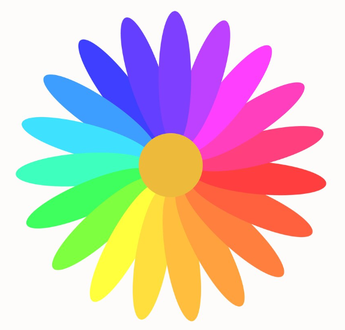

# Artisan Shop



This section for the Artisan Shop app is updating the colour scheme.

## Features
- **Colours**: Updating the primary,secondary and tertiary scheme for applying to light and dark mode.
- **Themes**: Setting those changes with the application.

## Installation

1. Clone the repository:
   ```sh
   git clone https://github.com/emily172/MAD2-Artisan.git

## References
https://m3.material.io/styles/color/system/overview
https://m2.material.io/design/color/the-color-system.html
https://htmlcolorcodes.com/color-picker/
https://stackoverflow.com/questions/74988479/change-background-color-surface-light-dark-jetpack-compose
https://medium.com/@rowaido.game/setting-up-material-theme-color-schemes-in-jetpack-compose-39140ea2e66a
https://stackoverflow.com/questions/74988479/change-background-color-surface-light-dark-jetpack-compose
https://www.freepik.com/free-vector/colorful-flower_763057.htm#fromView=search&page=2&position=40&uuid=11ae178a-1024-4b00-b102-17b295ae56fa&query=color+wheel+
