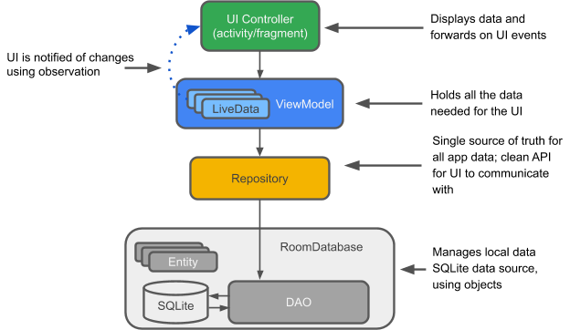

# Artisan Shop



This section for the Artisan Shop app provides a clean setup and maintainable codebase that adheres to the MVVM design pattern, 

## Navigation & Features

- **Room Database**: Used for local storage to store all of the artisan products.
- **Model**: Represents the data layer (Room entities, DAO interfaces).
- **View**: Represents the UI layer (Activities, Fragments).
- **ViewModels**: Refactoring the project to address managing UI-related data in the application.
- **Hilt**: Dependency injection


## Installation

1. Clone the repository:
   ```sh
   git clone https://github.com/emily172/MAD2-Artisan.git

## References
https://tutors.dev/topic/mobile-app-dev-2-2025/topic-05-architecture
https://miro.medium.com/v2/resize:fit:624/0*6mf2j-nPShT3_Pd4.png


## Table of Contents

- [Introduction](#introduction)
- [Features](#features)
- [Architecture](#architecture)
- [Setup](#setup)
- [Usage](#usage)
- [License](#license)

## Introduction

This sample app showcases the use of Room for local database storage and ViewModels for managing UI-related data lifecycle in Android. It follows the MVVM (Model-View-ViewModel) architectural pattern for a clean and maintainable codebase.

## Features

- Room Database for local data storage
- ViewModel for managing UI-related data
- LiveData for observing data changes
- Repository pattern for data abstraction

## Architecture

The project follows the MVVM architecture:
- **Model**: Represents the data layer, including Room entities and DAO interfaces.
- **View**: Represents the UI layer, usually activities and fragments.
- **ViewModel**: Manages UI-related data and communicates with the repository.

## Setup

### 1. Add Dependencies

Add the following dependencies in your `build.gradle` file:

```groovy
dependencies {
    implementation "androidx.lifecycle:lifecycle-viewmodel-ktx:2.3.1"
    implementation "androidx.lifecycle:lifecycle-livedata-ktx:2.3.1"
    implementation "androidx.room:room-runtime:2.3.0"
    kapt "androidx.room:room-compiler:2.3.0"
}
